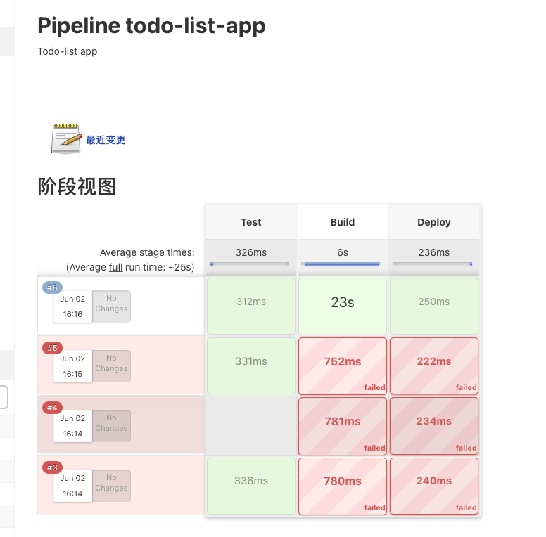
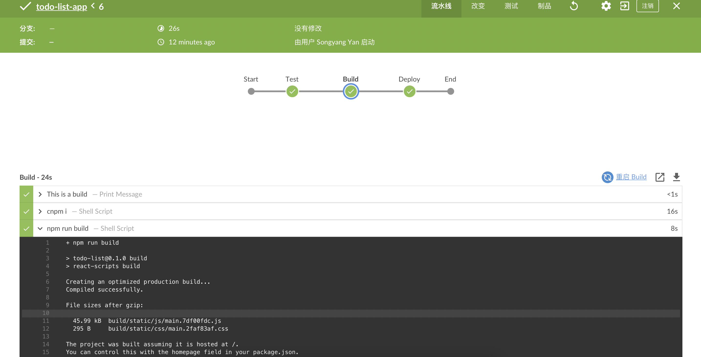

# Jenkins Homework

严宋扬 贺浩庭

运行截图：

具体过程：


# About


## Useful Docs
[vscode installation guide for mac/windows](https://www.runoob.com/w3cnote/vscode-tutorial.html	)


[node installation guide for mac/windows](https://www.runoob.com/nodejs/nodejs-install-setup.html)


[how to set taobao npm registry](https://juejin.cn/post/6856593559592796167)
## Homework
- Basic Requirement: Based on existing code, please finish the deletion feature of todo items.

- Bonus Challenge: Based on your knowledge from previous session, try to add some css styles for your todo list to make your todo list look better😙
### Filter and Map

In order to finish the quiz, you may need to be familar with Js array `filter` and `map` methods.

```js
const items = [1, 2, 3, 4];
const index = 2;
const filteredItems = items.filter((x, i) => i !== index);
```

```js
const items = [1, 2, 3, 4];
const doubledItems = items.map(x => x * 2); 
```
## How to start your application

Install dependencies:

```
npm i
```

In the project directory, you can run:

### `npm start`

Runs the app in the development mode.\
Open [http://localhost:3000](http://localhost:3000) to view it in your browser.

The page will reload when you make changes.
